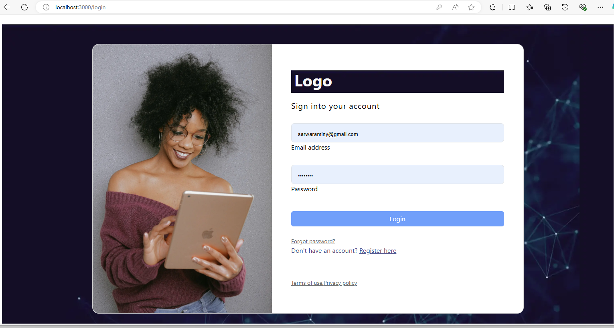
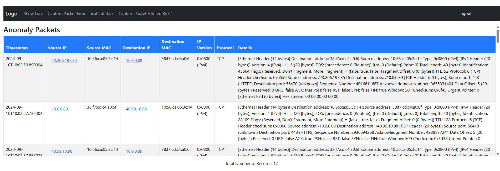
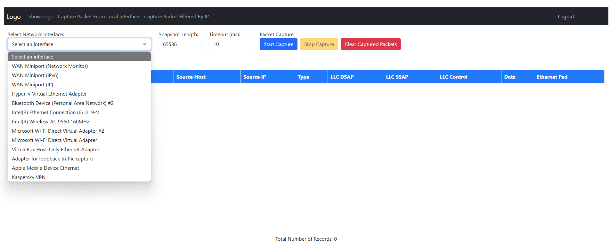
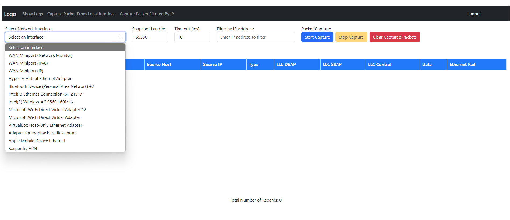
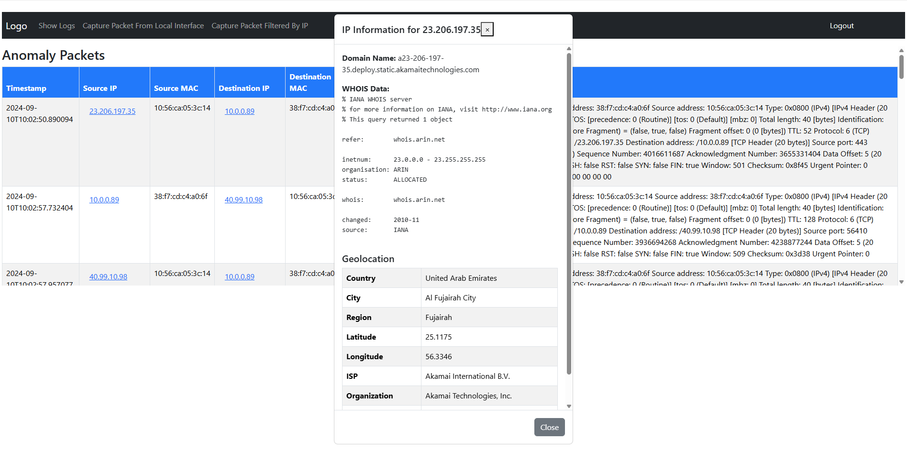

<h1>install winPcap from <a href="https://npcap.com/#download">nPcap Download</a></h1>
<h4>Run your application as administrator to capture packet</h4>

  <h1>Network Monitoring Tool (NMT)</h1>
  
The <strong>Network Monitoring Tool (NMT)</strong> is a powerful and customizable tool designed to monitor and analyze network traffic in real-time. It allows users to capture network packets, identify potential anomalies such as Man-In-The-Middle (MITM) attacks, ARP spoofing, and suspicious activity, and gather detailed insights on IP addresses, including geolocation information.

This project leverages modern technologies for both the backend and frontend:
  

  <ul>
    <li><strong>Frontend:</strong> ReactJS</li>
    <li><strong>Backend:</strong> Spring Boot (Java)</li>
    <li><strong>Database:</strong> PostgreSQL</li>
  </ul>

  <h2>Key Features</h2>
   <ul>
    <li>
      
<strong>Packet Capture:</strong>

      <ul>
        <li>Capture network traffic from a selected interface.</li>
        <li>Optionally filter packet capture by specifying a particular IP address or interface.</li>
      </ul>
    </li>
    <li>
      
<strong>Anomaly Detection:</strong>

      <ul>
        <li>Real-time anomaly detection using custom logic.</li>
        <li>Detection of network threats such as MITM attacks, ARP spoofing, and packet anomalies.</li>
      </ul>
    </li>
    <li>
      
<strong>IP Address Lookup:</strong>

      <ul><li>WHOIS lookup integrated to identify the geographical information of IP addresses found in captured packets.</li></ul>
    </li>
    <li>
      
<strong>User-Friendly UI:</strong>

      <ul>
        <li>A ReactJS-based intuitive and responsive interface to control packet capture, view detailed packet information, and analyze anomalies.</li>
        <li>Data visualization and logs for packet analysis.</li>
      </ul>
    </li>
   </ul>

   <h2>Technology Stack</h2>
   <h3>Frontend:</h3>
   <ul><li><strong>ReactJS:</strong> A modern JavaScript library for building fast, interactive user interfaces.</li></ul>
   <h3>Backend:</h3>
   <ul><li><strong>Spring Boot:</strong> A Java-based framework to develop REST APIs, handle business logic, and process data efficiently.</li></ul>
   <h3>Database:</h3>
   <ul><li><strong>PostgreSQL:</strong> A reliable and powerful open-source relational database to store captured network traffic and analysis results.</li></ul>
   
   <h2>Installation</h2>
   <h3>Prerequisites</h3>
   
Ensure that you have the following software installed:

   <ul>
     <li>Java 17+</li>
     <li>Node.js &amp; npm</li>
     <li>PostgreSQL 14+</li>
   </ul>
   <h3>Backend (Spring Boot)</h3>
   <ol>
     <li>
       
Clone the repository:

        <code style="background-color: gray; color: lightcyan; font-weight: bold;">
          git clone https://github.com/sarwaraminy/network-monitoring.git  
          cd api 
          mvn clean install
          java -jar target/network-monitoring-0.0.1-SNAPSHOT.jar
        </code>
     </li>
     <li>
      
Configure the PostgreSQL database in <code style="background-color: gray; color: lightcyan; font-weight: bold;">application.properties</code>:

      <code style="background-color: gray; color: lightcyan; font-weight: bold;">
        spring.datasource.url=jdbc:postgresql://localhost:5432/nmt_db  
        spring.datasource.username=your_db_username  
        spring.datasource.password=your_db_password  
      </code>
     </li>
     <li>
      
Run the FlywayDB migrations to set up the database schema:

      <code style="background-color: gray; color: lightcyan; font-weight: bold;">./mvnw flyway:migrate</code>
     </li>
     <h3>Frontend (ReactJS)</h3>
     <li>
      
Install dependencies:

      <code style="background-color: gray; color: lightcyan; font-weight: bold;">npm install</code>
     </li>
     <li>
      
Start React:

      <code style="background-color: gray; color: lightcyan; font-weight: bold;">npm start</code>
     </li>
   </ol>
   
   
The app will be available at <code>http://localhost:3000</code>.

   
   <h2>Usage</h2>
   <ol>
    <li><strong>Select Network Interface</strong>: From the frontend, choose a network interface from which to capture traffic.</li>
    <li><strong>Packet Capture</strong>: Initiate packet capture by specifying either an interface or an interface+IP combination.</li>
    <li><strong>Analyze Packets</strong>: The system will process captured packets and provide real-time analysis for anomalies.</li>
    <li><strong>WHOIS Lookup</strong>: Get geographical and domain information about IP addresses from the captured packets.</li>
    <li><strong>View Results</strong>: Review network anomalies, IP details, and packet logs in a user-friendly interface.</li>
  </ol>
  <h2>Future Plans</h2>
  <ul>
    <li>Advanced data visualization for packet analysis.</li>
    <li>Real-time notifications for detected network anomalies.</li>
    <li>Support for multiple protocols in packet analysis.</li>
  </ul>
  <h2>Contributing</h2>
  
Contributions are welcome! Please open an issue or submit a pull request with any improvements or new features.

  <h2>License</h2>
  
This project is licensed under the MIT License. See the <code>LICENSE</code> file for more details.

  
Feel free to adjust it as necessary, especially the repository links and specific details based on your setup!

  <h3>Screenshoots:</h3>
  <h4>Login page:</h4>
  
  

  <h4>Dashboard:</h4>
  
  

  <h4>Scan packets from an specific Interface:</h4>
  
  

  <h4>Scan packets from an specific Interface/IP:</h4>
  
  

  <h4>Whois Lookup service</h4>
  

